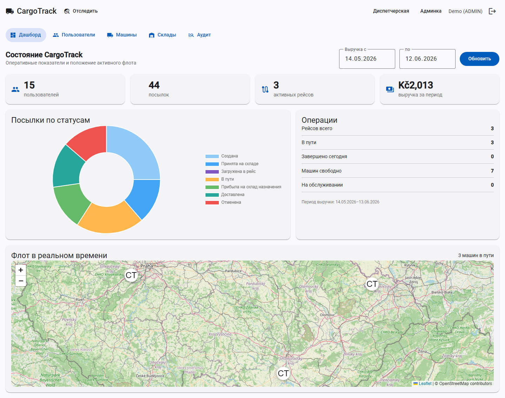
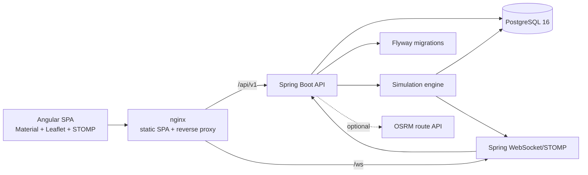
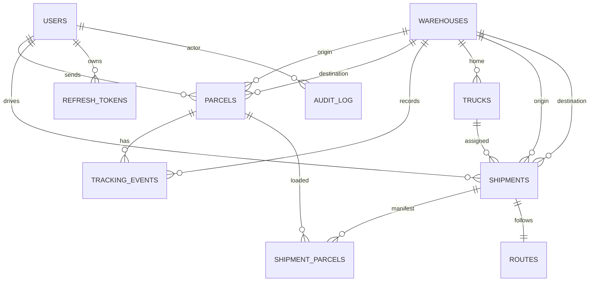

# CargoTrack

[](https://github.com/tymatu/cargo-track/actions/workflows/ci.yml)

CargoTrack is a full-stack cargo and parcel tracking system for local demo/review: parcels, warehouses, shipments, drivers, dispatcher workflows, admin dashboard, audit log, live fleet map, and public tracking.

**Stack:** Java 21, Spring Boot 3.5, Spring Security JWT, PostgreSQL 16, Flyway, Testcontainers, WebSocket/STOMP, Angular 21, Angular Material, Leaflet, Chart.js, Docker, nginx.

**Local demo URL:** http://localhost:8088 after the Docker stack is started.



## Run Locally

```bash
git clone https://github.com/tymatu/cargo-track.git
cd cargo-track
cp .env.example .env
docker compose -f docker-compose.prod.yml up -d --build
```

PowerShell:

```powershell
Copy-Item .env.example .env
docker compose -f docker-compose.prod.yml up -d --build
```

Open http://localhost:8088. No paid server or public deployment is required.

## Demo Accounts

All demo accounts use `CargoTrack123!`.

| Role | Email |
|---|---|
| Customer | `user@cargotrack.local` |
| Driver | `driver.prague@cargotrack.local` |
| Dispatcher | `dispatcher.prague@cargotrack.local` |
| Admin | `admin@cargotrack.local` |

Useful tracking numbers:

- `CT-DEMO00001`
- `CT-DEMO00031`
- `CT-DEMO00032`

The copied `.env.example` enables the explicit `prod,demo` local review profile. It seeds warehouses, demo users, trucks, parcels, active shipments, routes, and a background life generator. The admin dashboard should show moving trucks within the first minute.

Presentation flow: [docs/DEMO_SCRIPT.md](docs/DEMO_SCRIPT.md).
Full project documentation: [docs/PROJECT_DOCUMENTATION.md](docs/PROJECT_DOCUMENTATION.md).

## SDP Checklist

- Phase 0: Java 21, Angular, Docker, CI, lint/build/test gates.
- Phase 1: auth, registration, login, JWT refresh, logout.
- Phase 2: warehouses, users, trucks, employees.
- Phase 3: parcel creation, pricing, validation, public tracking.
- Phase 4: dispatcher shipment planning/loading and role ownership.
- Phase 5: admin users/trucks/warehouses/dashboard/audit.
- Phase 6: route geometry, OSRM fallback/cache, map tracking.
- Phase 7: WebSocket live topics for truck position, parcel events, and admin fleet.
- Phase 8: demo seed, simulator, Docker stack, local smoke tests.

## Features

- JWT auth with refresh-token rotation, reuse detection, logout, blocking, and token revocation.
- RBAC for `USER`, `DRIVER`, `DISPATCHER`, `ADMIN`, including ownership checks against IDOR.
- Parcel lifecycle with validated state transitions and timeline events.
- Shipment lifecycle: planning, loading, departure, simulated movement, arrival, delivery.
- Live updates over WebSocket/STOMP with JWT on `CONNECT` and protected subscriptions.
- Public tracking without login, refreshed automatically every 3 seconds.
- Route cache with OSRM client and fallback geometry.
- Admin dashboard with aggregate stats, Chart.js, live fleet map, CRUD, user search, and audit detail panel.
- AOP audit log with who/what/where/when metadata and old/new JSON.
- Dockerized backend/frontend/PostgreSQL stack for local review.

## Architecture



## ER Diagram



## Development

```bash
docker compose up -d
cd backend && ./mvnw spring-boot:run
cd frontend && npm start
```

For local backend runs outside Docker, export values from `.env` into the shell (`DB_PASSWORD`, `JWT_SECRET`, etc.). The dev PostgreSQL is available on `localhost:5433`; pgAdmin is on http://localhost:5050.

## Verification

Backend:

```bash
cd backend
./mvnw -B verify
```

Frontend:

```bash
cd frontend
npm run lint
npm test -- --watch=false
npm run build
```

Production compose config:

```bash
DB_PASSWORD=local-db-password JWT_SECRET=local-jwt-secret-local-jwt-secret-local-jwt-secret-123456 docker compose -f docker-compose.prod.yml config --quiet
```

E2E smoke tests require the local demo stack:

```bash
SPRING_PROFILES_ACTIVE=prod,demo SIMULATION_ENABLED=true DEMO_SEED_ENABLED=true DEMO_LIFE_ENABLED=true \
docker compose -f docker-compose.prod.yml up -d --build
cd frontend
npx playwright install chromium
npm run test:e2e
```

Production dependency audit:

```bash
cd frontend
npm audit --omit=dev --audit-level=high
```

## Security

See [SECURITY.md](SECURITY.md) and [docs/HARDENING.md](docs/HARDENING.md).

## Resume Line

CargoTrack is a full-stack cargo tracking system built with Spring Boot, Angular, and PostgreSQL: JWT auth with refresh-token rotation, four-role RBAC plus ownership checks, AOP JSON audit log, WebSocket/STOMP live tracking, route simulation with OSRM/fallback geometry, Testcontainers, Docker, CI, and local Playwright smoke tests.
